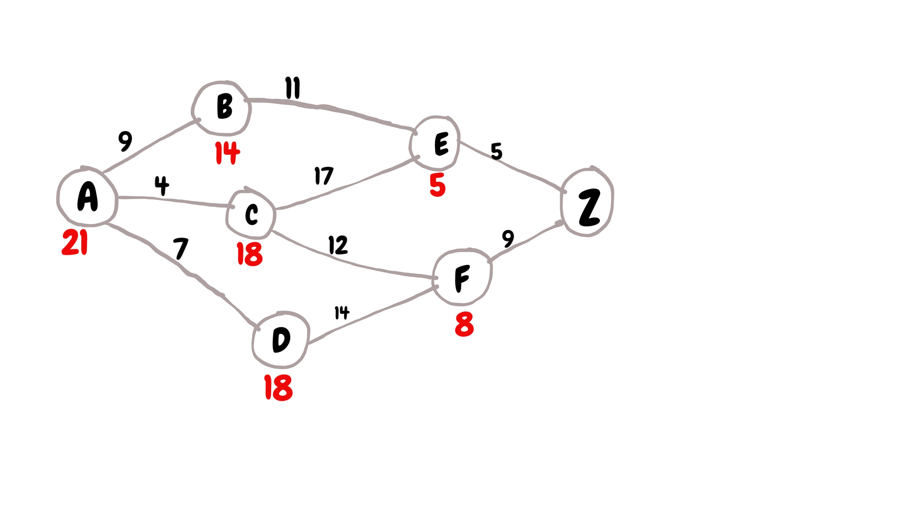
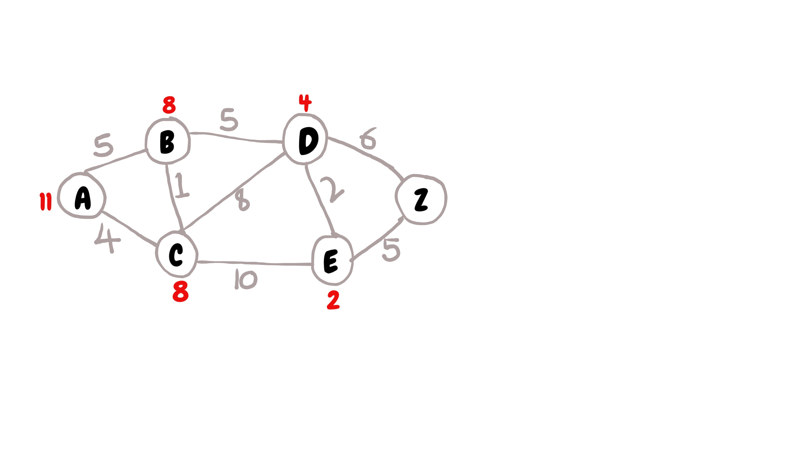

# A* search
Consider the follow graph:

The numbers in red are the heuristic values

The path to all the nodes using A* search is calculated as:

## Step 1
Node | Status | Shortest distance from A (g(x)) | Heuristic distance to Z (h(x)) | Total distance (g(x) + h(x)) | Previous node
--- | --- | --- | ---- | ----| ---
A | current | 0 | 21 | 21 | - | -
B | - | unknown | 14 | - | - | -
C | - | unknown | 18 | - | - | -
D | - | unknown | 18 | - | - | -
E | - | unknown | 5 | - | - | -
F | - | unknown | 8 | - | - | -
Z | - | unknown | 0 | - | - | -

- The shortest distance from A to A is 0
- Then update the shortest distance of all nodes connected to A from A, and set the previous node value
- The table will be then be updated to:

Node | Status | Shortest distance from A (g(x)) | Heuristic distance to Z (h(x)) | Total distance (g(x) + h(x)) | Previous node
--- | --- | --- | ---- | ----| ---
A | current | 0 | 21 | 21 | -
B | - | 9 | 14 | 23 | A
C | - | 4 | 18 | 22 | A
D | - | 7 | 18 | 25 | A
E | - | unknown | 5 | - | - | -
F | - | unknown | 8 | - | - | -
Z | - | unknown | 0 | - | - | -

## Step 2
- Mark node A as visited and use the unvisited node with the *smallest total distance* as the current distance.
- From the previous table, the unvisited node with the smallest distance is node C

Node | Status | Shortest distance from A (g(x)) | Heuristic distance to Z (h(x)) | Total distance (g(x) + h(x)) | Previous node
--- | --- | --- | ---- | ----| ---
A | visited | 0 | 21 | 21 | -
B | - | 9 | 14 | 23 | A
C | current | 4 | 18 | 22 | A
D | - | 7 | 18 | 25 | A
E | - | unknown | 5 | - | - | -
F | - | unknown | 8 | - | - | -
Z | - | unknown | 0 | - | - | -

- Add the distance from A to C (which is the current node), to the distances of the adjacent nodes of C.
- Only replace the shortest distance when the newly calculated value is smaller than the previous value or if it is unknown. I.e.
  - C to C is O. `O + 4 = 4` (no need to change)
  - C to E is 17. `17 + 4 = 21`
    - Replace the value as the original one is unknown
  - C to F is 12. `12 + 4 = 16`
    - Replace the value as the original one is unknown
- Update the shortest distance, total distance and the previous column of the columns changed

Node | Status | Shortest distance from A (g(x)) | Heuristic distance to Z (h(x)) | Total distance (g(x) + h(x)) | Previous node
--- | --- | --- | ---- | ----| ---
A | visited | 0 | 21 | 21 | -
B | - | 9 | 14 | 23 | A
C | current | 4 | 18 | 22 | A
D | - | 7 | 18 | 25 | A
E | - | 21 | 5 | 26 | C
F | - | 16 | 8 | 24 | C
Z | - | unknown | 0 | - | - | -

## Step 3
- Mark node C as visited
- The next current node to be used is node B, as it has the smallest total distance

Node | Status | Shortest distance from A (g(x)) | Heuristic distance to Z (h(x)) | Total distance (g(x) + h(x)) | Previous node
--- | --- | --- | ---- | ----| ---
A | visited | 0 | 21 | 21 | -
B | current | 9 | 14 | 23 | A
C | visited | 4 | 18 | 22 | A
D | - | 7 | 18 | 25 | A
E | - | 21 | 5 | 26 | C
F | - | 16 | 8 | 24 | C
Z | - | unknown | 0 | - | - | -

- Add the distance from A to B to all adjacent unvisited nodes of B and update the columns accordingly.
  - A to B is 9
  - The unvisited adjacent node of B is E only. The calculated shortest distance is: `11 + 9 = 20`
  - `20 < 21` so change the necessary columns of node E.

Node | Status | Shortest distance from A (g(x)) | Heuristic distance to Z (h(x)) | Total distance (g(x) + h(x)) | Previous node
--- | --- | --- | ---- | ----| ---
A | visited | 0 | 21 | 21 | -
B | current | 9 | 14 | 23 | A
C | visited | 4 | 18 | 22 | A
D | - | 7 | 18 | 25 | A
E | - | 20 | 5 | 25 | B
F | - | 16 | 8 | 24 | C
Z | - | unknown | 0 | - | - | -

# Step 4
- Similar to the previous steps, the next current node is node F

Node | Status | Shortest distance from A (g(x)) | Heuristic distance to Z (h(x)) | Total distance (g(x) + h(x)) | Previous node
--- | --- | --- | ---- | ----| ---
A | visited | 0 | 21 | 21 | -
B | visited | 9 | 14 | 23 | A
C | visited | 4 | 18 | 22 | A
D | - | 7 | 18 | 25 | A
E | - | 20 | 5 | 25 | B
F | current | 16 | 8 | 24 | C
Z | - | unknown | 0 | - | - | -

- The adjacent unvisited nodes to node F are D and Z
- The distance from A to F is 16
- F to D:
  - `16 + 14 = 30`
  - `30 > 25` hence no change
- F to Z:
  - `16 + 9 = 25`
  - `25` cannot be compared to unknown so change the necessary columns

Node | Status | Shortest distance from A (g(x)) | Heuristic distance to Z (h(x)) | Total distance (g(x) + h(x)) | Previous node
--- | --- | --- | ---- | ----| ---
A | visited | 0 | 21 | 21 | -
B | visited | 9 | 14 | 23 | A
C | visited | 4 | 18 | 22 | A
D | - | 7 | 18 | 25 | A
E | - | 20 | 5 | 25 | B
F | current | 16 | 8 | 24 | C
Z | - | 25 | 0 | 25 | F

## Step 5
- Similar to either of steps 2 or 3, the next current node is D.
- Note that the remaining unvisited nodes have the same total distance, but D has been picked due to its alphabetical order

Node | Status | Shortest distance from A (g(x)) | Heuristic distance to Z (h(x)) | Total distance (g(x) + h(x)) | Previous node
--- | --- | --- | ---- | ----| ---
A | visited | 0 | 21 | 21 | -
B | visited | 9 | 14 | 23 | A
C | visited | 4 | 18 | 22 | A
D | current | 7 | 18 | 25 | A
E | - | 20 | 5 | 25 | B
F | visited | 16 | 8 | 24 | C
Z | - | 25 | 0 | 25 | F

- There are no unvisited adjacent nodes to node D. Therefore, mark it as skipped

Node | Status | Shortest distance from A (g(x)) | Heuristic distance to Z (h(x)) | Total distance (g(x) + h(x)) | Previous node
--- | --- | --- | ---- | ----| ---
A | visited | 0 | 21 | 21 | -
B | visited | 9 | 14 | 23 | A
C | visited | 4 | 18 | 22 | A
D | skipped | 7 | 18 | 25 | A
E | - | 20 | 5 | 25 | B
F | visited | 16 | 8 | 24 | C
Z | - | 25 | 0 | 25 | F

- The remaining nodes are nodes F and Z. However, visiting node E will not lead to a shortee path as its total distance is the same for that node of Z.
- Therefore, the total distance from **A to Z via F** is `25`.
- Reading the path from Z to A in the previous column , we have: `Z->F->C->A`
  - B is skipped as node E was not visited
  - A for node D is skipped so it is not included
  - this gives the path of `A->C->F->Z`
- Therefore, the shortedt path to Z is `A->C->F->Z` with a length of 25

## Assignment

Can you reproduce the steps that gave the following results for the given graph?

Node | Status | Shortest distance from A (g(x)) | Heuristic distance to Z (h(x)) | Total distance (g(x) + h(x)) | Previous node
--- | --- | --- | ---- | ----| ---
A | visited | 0 | 11 | 11 | -
B | visited | 5 | 8 | 13 | A
C | visited | 4 | 8 | 12 | A
D | visited | 10 | 4 | 14 | B
E | visited | 12 | 2 | 14 | D
Z | - | 25 | 0 | 16 | D

The shortest path from A to Z is: `A->B->D->Z` with a length of `16`
