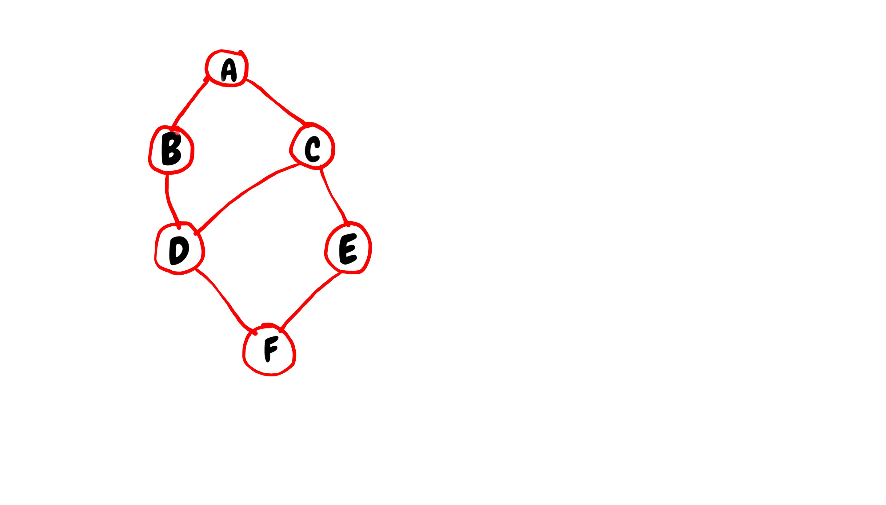

# Breadth-first Search
Consider the following graph:



The above graph can be represented using either:
* adjacency list
* adjacency matrix

The adjacency list representation of the graph is:

Node | Adjacency list
---- | ----
A | B, C
B | A, D
C | A, D, E
D | B, C, F
E | C, F
F | D, E

The adjacency matrix representation is:

Node | A | B | C | D | E | F |
--- | --- | --- | --- | --- | --- | --- |
A | | 1 | 1 | | |
B | 1 | | | 1 | | |
C | 1 | | | 1 | 1
D | | 1 | 1 | | | 1|
E | | | 1 | | | 1 |
F | | | | 1 | 1 |

The value 1 indicates an edge between 2 vertices

To traverse the graph breadthwise:
- Move horizontally and visit all the nodes of the current level
- Move to the next level, repeat the process until all levels are visited.
- Remember to mark all nodes (or vertices) that have been visited with a flag, in order to ensure a vertex is visited only once

A queue data structure is used in order to retrieve the next vertex to be used for the traversal, when a dead end occurs in an iteration.

## How is the traversal done?
Let's revisit the graph:


How can the above graph be traversed breadthwise?

**Step 1**

*Starting with node A*:
- Insert vertex A into the queue Q
- Mark it as visited
- Then visit all its unvisited neighbours, starting from the left towards the right and mark them as visited:
  - Visit node B, enqueue it and mark it as visited
  - Dequeue A from Q and visit its neighbours
  - As B is marked as visited, it is ignored.
  - The next unvisited neighbour is C. Visit C, enqueue it and mark it as visited.


**Step 2**

All the second level nodes have been visited. Backtrack to a previous node by dequeueing the next vertex in the queue Q, which is node B

- The neighbours of B are A and D
- A is already marked as visited so it is ignored. The only unvisited neighbour is D
- Visit vertex D, enqueue it and mark it as visited.
- As we have reached the end of the iteration in this level, move to step 3

**Step 3**

Dequeue the next vertex in the queue Q, whose node is C.
- The neighbours of C are A, D, E
- A and D are marked as visited so they are ignored
- Visit node E, enqueue it and mark it as visited
- Node E marks the end of that level so move to step 4

**Step 4**

Dequeue the next vertex in Q, which is node D.
- The neighbours of D are B, C, F
- Nodes B nad C are already marked as visited, therefore ignore them
- Visit node F, enqueue it and mark it as visited
- Node F marks the end of the iteration, then move to the next step

**Step 5**
Repeat the steps of:
- Dequeuing element from the queue Q
- checking if their neighbours are unvisited and visit them
- repeating until the queue is empty

The breadth-first search of the graph gives the following path:

```
A->B->C->D->E->F
